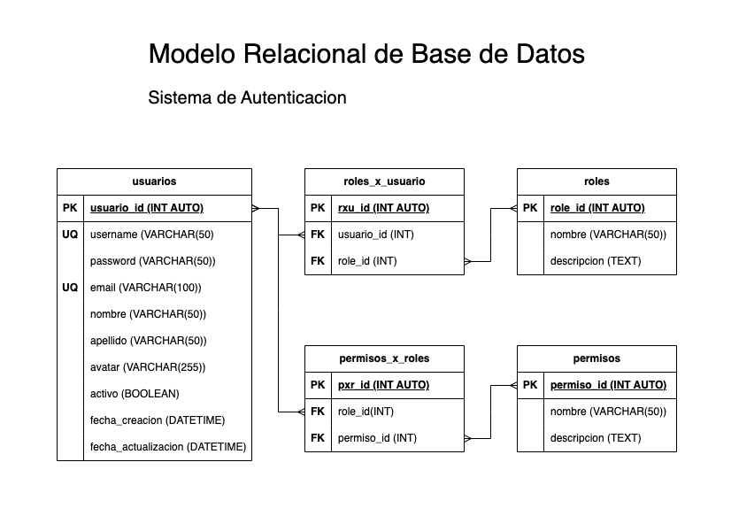

# Sistema de Autenticacion

## Listado de Entidades

### usuarios **(ED)**

- usuario_id **(PK)**
- username **(UQ)**
- password
- email **(UQ)**
- nombre
- apellido
- avatar
- activo
- fecha_creacion
- fecha_actualizacion

### roles **(EC)**

- role_id **(PK)**
- nombre
- descripcion

### permisos **(EC)**

- permiso_id **(PK)**
- nombre
- descripcion

### roles_x_usuario **(EP)**

- rxu_id **(PK)**
- usuario_id **(FK)**
- role_id **(FK)**

### permisos_x_roles **(EP)**

- pxr_id **(PK)**
- role_id **(FK)**
- permiso_id **(FK)**

## Relaciones

1. **Usuarios** tienen **roles** (_M - M_).
1. **Roless** tienen **permisos** (_M - M_).

## Diagramas

### Modelo Relacional de la DB

## Logica de Negocio

### usuario

1. Crear nuevo usuario.
1. Leer todos los usuarios.
1. Leer un usuario en particular.
1. Actualizar un usuario.
1. Validar un usuario.
1. Habilitar un usuario.
1. Inhabilitar un usuario.
1. Actualizar datos de un usuario.
1. Actualizar password de un usuario.
1. Eliminar un usuario.

### roles

1. Crear un role.
1. Leer todos los roles.
1. Leer un role en particular.
1. Actualizar un role.
1. Eliminar un role.

### permisos

1. Crear un permiso.
1. Leer todos los permisos.
1. Leer un permiso en particular.
1. Actualizar un permiso.
1. Eliminar un permiso.

### roles_x_usuario

1. Crear un rxu.
1. Leer todos los rxu.
1. Leer un rxu en particular.
1. Leer todos los rxu de un usuario en particular.
1. Eliminar un rxu.

### permisos_x_roles

1. Crear un pxr.
1. Leer todos los pxr.
1. Leer un pxr en particular.
1. Leer todos los pxr de un usuario en particular.
1. Eliminar un pxr.