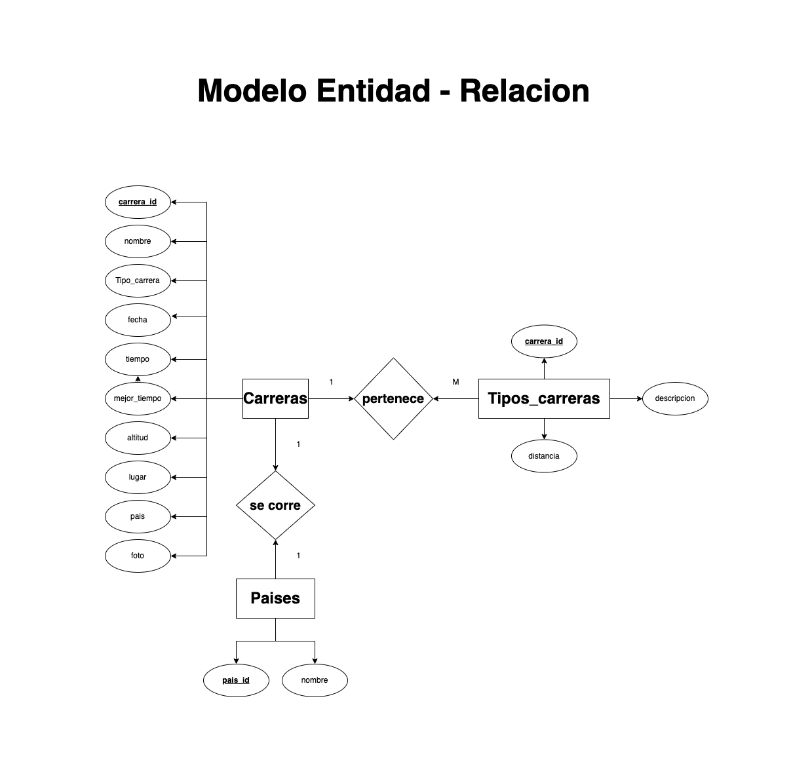
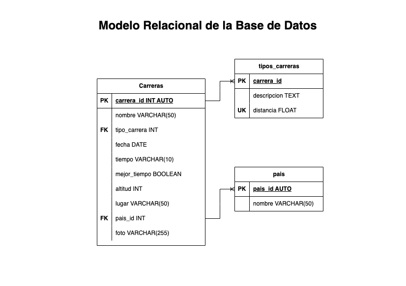

# Carreras

## Listado de entidades

### carreras **(ED)**

- carrera_id **(PK)**
- nombre
- tipo_carrera **(FK)**
- fecha
- tiempo
- mejor_tiempo
- altitud
- lugar
- pais **(FK)**
- foto

### tipo_carrera **(EC)**

- tipo_carrera **(PK)**
- nombre
- distancia **(UQ)**

### paises **(EC)**

- pais_id **(PK)**
- nombre

## Relaciones

1. Una **carrera** _pertenece_ a un **tipo de carrera** (_1 a 1_)
1. Una **carrera** se _corre_ en un **pais** (_1 a 1_)

## Diagramas

### Modelo Entidad - Relacion

### Modelo Relacional de la DB

## Reglas de Negocio

### carreras

1. Crear el registro una carrera.
1. Leer el registro de una(s) carrera(s), dada una condicion en partiular.
1. Leer todos los registros de la entidad carreras.
1. Actualizar los datos de una carrera, dada una condicion en partiular.
1. Eliminar los datos de una carrera, dada una condicion en partiular.

### tipos_carreras

1. Todos los valores del atributo distancia, deberan estar expresados en _km_ y no se podran repetir.
1. Crear el registro un tipo carrera.
1. Leer el registro de un(os) tipo(s) de carrera, dada una condicion en partiular.
1. Leer todos los registros de la entidad tipos de carreras.
1. Actualizar los datos de un tipo de carrera, dada una condicion en partiular.
1. Eliminar los datos de un tipo de carrera, dada una condicion en partiular.

### paises

1. Crear el registro un pais.
1. Leer el registro de un(os) pais(es), dada una condicion en partiular.
1. Leer todos los registros de la entidad paises.
1. Actualizar los datos de un pais, dada una condicion en partiular.
1. Eliminar los datos de un pais, dada una condicion en partiular.