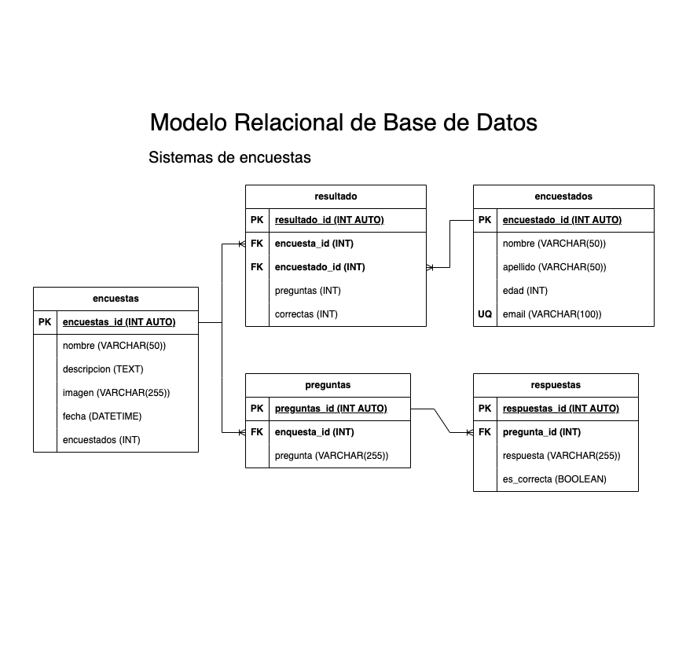

# Ecuestas

## Listado de Entidades

### Encuestas **(ED)**

- encuesta_id **(PK)**
- nombre
- descripcion
- imagen
- fecha
- encuestados

### preguntas **(ED)**

- pregunta_id **(PK)**
- encuesta_id **(FK)**
- pregunta

### respuestas **(ED)**

- respuesta_id **(PK)**
- pregunta_id **(FK)**
- respuesta
- es_correcta

### encuestados **(ED)**

- encuestado_id **(PK)**
- nombre
- apellidos
- edad
- email **(UQ)**

### resultado **(ED|EP)**

- resultado_id **(PK)**
- enquesta_id **(FK)**
- encuestado_id **(FK)**
- preguntas
- correctas

## Relaciones

1. Una **encuesta** tiene **preguntas** (_1 - M_)
1. Una **pregunta** tiene **respuestas** (_1 - M_)
1. Una **encuesta** tiene **resultados** (_1 - M_)
1. Un **encuestado** tiene **resultados** (_1 - M_)

## Diagramas

### Modelo Relacional de la DB

## Reglas de Negocio

### encuestas

1. Crear un encuesta.
1. Leer todas las encuestas.
1. Leer una encuesta en particular.
1. Actualizar una encuesra.
1. Eliminar una encuesta.
1. Aumentar en 1 el valor del atributo encuestados cada que un enquestado complete la encuesta.

### preguntas

1. Crear una pregunta.
1. Leer todas las preguntas.
1. Leer una pregunta en particular.
1. Actalizar una pregunta.
1. Eliminar una pregunta.

### respuestas

1. Crear una respuesta.
1. Leer todas las respuestas.
1. Leer una respuesta en particular.
1. Actualizar una respuesta.
1. Eliminar una respuesta.

### encuestados

1. Crear un encuestado.
1. Leer todos los encuestados.
1. Leer un encuestado en particular.
1. Actializar un enquestado.
1. Eliminar un enquestado.
1. Antes de crear un enquestado en la entidad, verificar mediante su email que no exista.

### resultados

1. Crear un resultado.
1. Leer todos los resultados.
1. Leer un resultado en particular.
1. Actualizar un resultado
1. Eliminar un resultado
1. Sacar el porcentaje de asertividad que tuvo el encuestado al contestar la encuesta.

